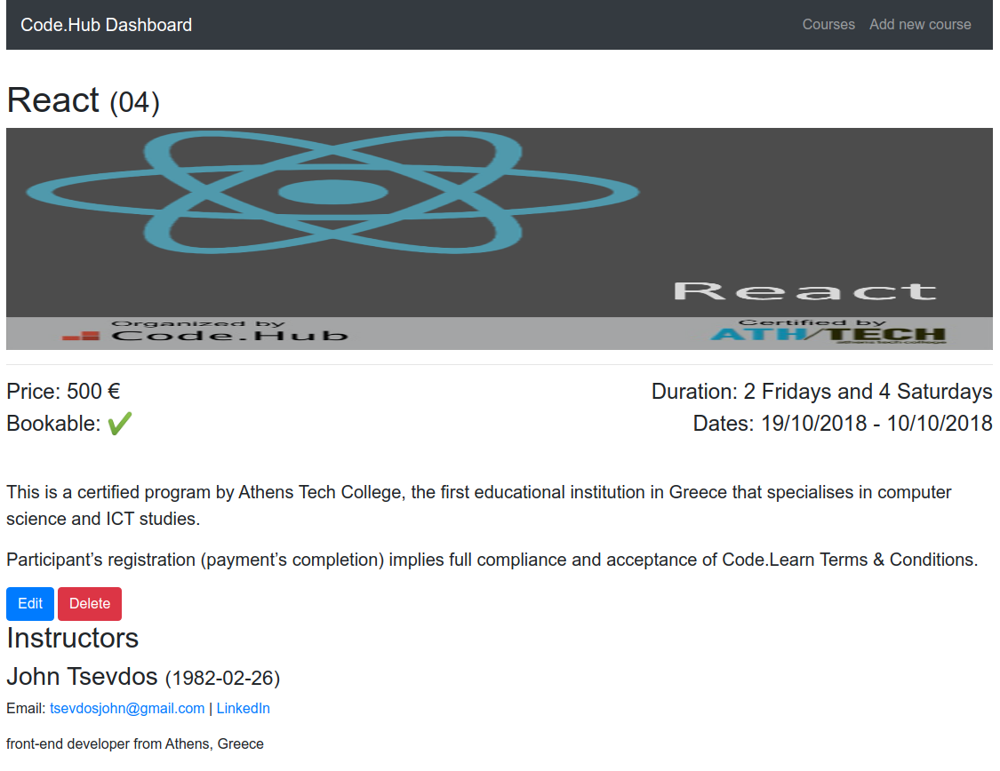

# React Project

## App details

The application was bootstraped using [Create React App](https://reactjs.org/docs/create-a-new-react-app.html). You can add any aditional libraries like the below:

- [React Router](https://github.com/ReactTraining/react-router) - for client-side (browser) routing
- [axios](https://github.com/axios/axios) - for HTTP requests
- any UI library such as [Ant Design](https://ant.design/), [reactstrap](https://reactstrap.github.io/) or [Material UI](https://material-ui.com/)
- any other global state management tool such as [ContextAPI](https://reactjs.org/docs/context.html), [Redux](https://redux.js.org/) or [MobX](https://mobx.js.org/).

## Fake REST API

The only already installed dependency is the [JSON server](https://github.com/typicode/json-server) (development dependency), a "fake" REST API. This API exposes 3 different resourses (stats, courses and instructors) and you can view it on `db.json` file. We will demonstrate how this API works, but feel free to read the package details and this [nice introductory article](https://scotch.io/tutorials/json-server-as-a-fake-rest-api-in-frontend-development). For the visual learners there is also a nice [quick intro video](https://egghead.io/lessons/javascript-creating-demo-apis-with-json-server).

## Run locally

You need to have node.js installed. I am using node version `12.17` and npm version `6.14.4`, but you can use any modern node/npm version you want. When you are ready, you can install all dependencies and run the development servers by typing the below commands:

```
npm install
npm run api // Runs API server in port 3001
npm start // Runs the create react app server in port 3000
open http://localhost:3000
```

When you are ready start implementing the below user stories. The screenshots where taken after using [reactstrap](https://reactstrap.github.io/) (a Bootstrap implementation for React) UI library, but feel free to use whichever one you like. Just use the components that make more sence and display the screens / data nicely.

## User stories

### Dashboard page

The dashbord page must contain:

1. Code.Hub's stats (students, courses, instructors and events)
2. a list with the last 5 courses
3. every course must have a link that leads to the course details page
4. a link that leads to the courses page

#### Dashboard (sample)


### Courses page

The courses page must contain:

1. all the available courses
2. every course must have a link that leads to the course details page

#### Courses Page (sample)


### Course details page

The course details page must contain:

1. all the details of the course
2. all the course instructors

#### Courses Details Page (sample)



### Add new course page

The add new course page must contain:

1. a form with the appropriate course fields
2. a submit button that posts the data correctly

#### Add new course page (sample)


### Extras / Bonus

- Add client-side validations
