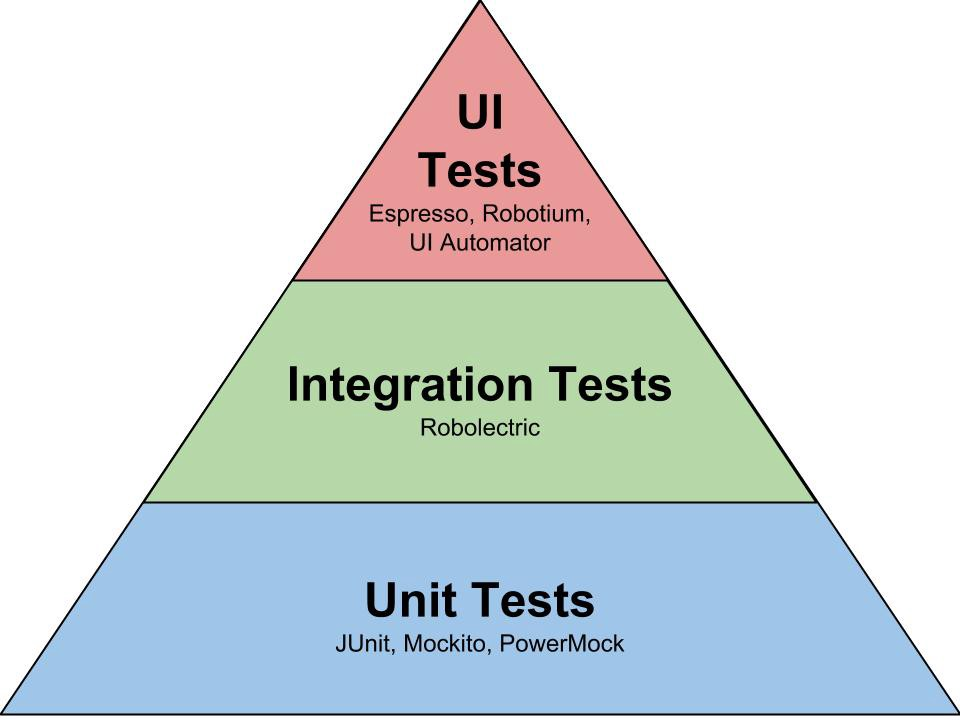
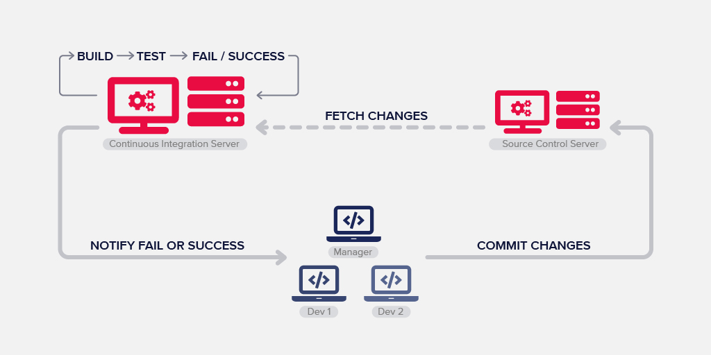

# React Testing

[tsevdos.me](https://tsevdos.me/) / [@tsevdos](https://twitter.com/tsevdos)

---

# Agenda

All the content can be found [here](https://github.com/codehub-learn/React-Training).

- what is testing
- react testing (jest / react-testing-library)
- end to end tests (Cypress)

---

# Rules

Feel free to interrupt me for:

- questions
- relevant comments

---

<!-- # Testing 101

- any ex-testers in the room?
- anyone who write tests?
- has anyone break a build?
- has anyone break the production?
- how much harm have you done to your company / users?

--- -->

# Testing 101: why we test?

- confidence
  - prove our code works
  - refactoring / easier and faster additions / changes
- code quality and design
- documentation
- think about issues and edge cases
- reduce technical debt

---

# Types of tests

- unit tests: test one isolated unit / piece of code
- integration tests: test the combination of features
- end-to-end tests: test a full interaction path in your app

---

# Testing pyramid

---

# Testing Trophy

---

# Continuous Integration

---

# What CI does for us?

- detect and fix issues early (hopefully)
- avoid “integration hell”
- improve quality and testability
- continuous feedback (automated)
- code metrics
- increase transparency and communication
- running tests frequently
- confidence you’re building a solid solution

---

# Testing tools: Test runner

- executes tests and summarizes the results in the terminal
- Jest, Mocha, Jasmine, AVA, etc.

---

# Testing tools: Assertion library

- provide BDD and / or TDD styles for testing
  - foo.should.equal('bar');
  - expect(foo).to.equal('bar');
  - assert.equal(foo, 'bar');
- Jest, Chai, Jasmine etc.

---

# Testing tools: e2e-testing tools

- act as a real user / browser
- Selenium, Puppeteer, Cypress

---

# Unit testing phases

- setup
- test
- teardown

---

# Unit test exercise

- Edit the file `./src/examples/01/wordCount.js` in order to pass all tests.
- Test file: `./src/examples/01/__tests__/wordCount.test.js`

---

<!-- # Uint test exercise 2

- Edit the file `./src/examples/02/isLeap.js` in order to pass all tests.
- Test file: `./src/examples/02/__tests__/isLeap.test.js`

--- -->

# React testing library

- jest test runner
- render library
- testing components

---

# Jest

- not just a test runner
- super fast (runs tests in parallel using workers)
- built-in mocks and spies
- built-in code coverage report
- snapshot testing
- zero configuration
- many more...

---

# React testing library

A JS testing library, builds on top of [DOM Testing Library](https://testing-library.com/docs/dom-testing-library/intro/) by adding APIs for working with React components.

---

# React testing library

- plays good with jest test runner
- light-weight solution for testing
- works with any environment that provides DOM APIs

---

# Snapshot Testing

Snapshot tests are a very useful tool whenever you want to make sure your UI does not change unexpectedly.

---

# React testing

Examples 03 - 05

---

# Snapshots issues

- they fail on implementation details
- accidentally update snapshots (without really reviewing them)

---

# React testing library exercise

`(./app/examples/06/Input.test.js)`

- Write tests for this simple component

---

# End to end testing

- what is Cypress
- Cypress features
- what you can do with it

---

# What is Cypress

- end to end testing tool
- great features
- developer friendly
- easy to learn & setup

---

# Features: automatic waiting

- commands that make sence
- never add waits or sleeps to your tests
- waits for commands and assertions
  before moving on
- no more async hell

---

# Features: time travel

- snapshots as your tests run
- use the "command log" to see
  what happened at each step

---

# Features: the rest

- informative and intuitive debugging
- spies and stubs (you can even
  stub network traffic)
- screenshots and videos
- it's fast and live reloads
- many more...

---

# Cypress test runner

- electron app (UI mode)
- terminal (headeless mode)

---

# Supported browsers

- Electron (terminal)
- Chrome / Chromium (canary)
- Edge (beta and canary)
- Firefox (developer edition and nightly)
- Safari and Internet Explorer are not officially supported

---

# End-2-end tests demo

- run tests in terminal
- run tests UI
- have a look at the project

---

# That's all folks

### Questions / Discussions?
